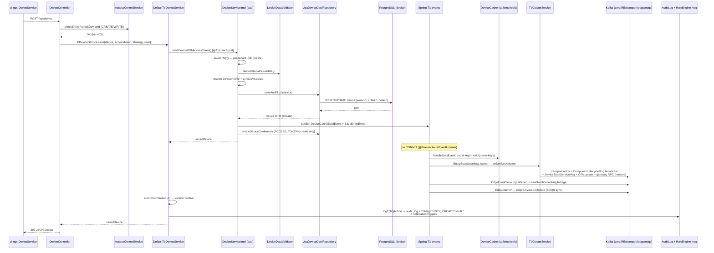

# Research: Oś encji (common/data + dao + application)

**Date**: 2026-06-11T15:49:18+02:00
**Researcher**: Claude (Fable 5)
**Git Commit**: 5f6f69dd6acc365df55b1a0f02811187efdb4e7a
**Branch**: master
**Repository**: thingsboard

## Research Question

Przeanalizować oś encji ze szczególnym uwzględnieniem obszarów z `context/map/repo-map.md` (strefa ryzyka #4: konwój `common/data` + `dao` + `application`, 115 wspólnych commitów; huby `TenantId`/`EntityId`/`EntityType`; migracje SQL; przechodni classpath). Trzy równoległe analizy: (1) trace e2e od entry pointu do zapisu/odczytu i z powrotem, (2) luki w pokryciu testami na tej ścieżce, (3) blast radius — co musi zmienić się razem (graf statyczny + co-change z historii gita). Wyłącznie analiza stanu obecnego. Encja reprezentatywna: **Device**.

## Summary

Oś encji to pięciowarstwowy konwój: `Controller → Tb*Service (application) → *ServiceImpl (dao) → Jpa*Dao/Repository → PostgreSQL`, z side-effectami rozprowadzanymi **wyłącznie eventami Springa po commicie** (cache, klaster/Kafka, edge, EDQS, audyt, version control). Wzorzec jest spójny i celowo odprzęgnięty (moduł `dao` nie zna Kafki), ale ma trzy systemowe słabości potwierdzone i statycznie, i historią gita:

1. **Dodanie jednego pola do encji wymaga ~10 ręcznych punktów mapowania**, z których kompilator wymusza tylko 3–4. Reszta (konstruktor kopiujący `Device(Device)`, `AbstractDeviceEntity↔toDevice()`, `ProtoUtils`, `FieldsUtil`/EDQS, `EntityKeyMapping`, `schema_update.sql`, lustro TS) zawodzi **cicho** — pole znika po drodze. Historia gita dokumentuje realne wpadki: feature `version` (2024-07) wymagał 2 fix-commitów (zapomniane proto, potem zły typ `int32`→`int64`), a `displayName` (2025-10) rozjechał SQL i EDQS na 1 dzień.
2. **Brak szybkiej pętli testowej**: na całej ścieżce zapisu dominują ciężkie testy `@DaoSqlTest` (pełny Spring + realna baza); `DefaultTbDeviceService` nie ma ani jednego testu jednostkowego. Największe dziury: `findDevicesByQuery`/`getDevicesByIds` (logika bezpieczeństwa per-device — **zero pokrycia**), `saveDevice(..., doValidate=false)`, spójność cache po kolizji nazwy.
3. **Dwa podwójne źródła prawdy bez szwu**: `schema-entities.sql` vs `schema_update.sql` (tylko 47% współzmian w jednym commicie — migracje dogrywane osobno) oraz `EntityKeyMapping` (SQL) vs `BaseEntityData`/`FieldsUtil` (EDQS).

Inwersja warstw z mapy repo potwierdzona co do linii — ale ast-grep wykazał, że krawędzie serwis→kontroler są **dwie**, nie jedna: `AbstractBulkImportService.java:60` importuje `BaseController` (tylko statyczne `toException`, użycia `:233`, `:262`) oraz `AccessValidator.java:63` importuje `HttpValidationCallback` (użycie `:189`). Liczba kontrolerów doprecyzowana ast-grepem: **60** klas rozszerza `BaseController` (57 bezpośrednio + 3 przez `AbstractRpcController`/`AutoCommitController`), nie „~80" jak w repo-map.

---

## 1. Feature overview

### Czym jest oś encji

Oś encji to kanoniczny przepływ CRUD każdej encji domenowej ThingsBoard (Device, Asset, Customer, …): model w `common/data`, fasada serwisowa + walidacja + cache + transakcje w `dao`, orkiestracja (audyt, version control, powiadomienia) w `application`, REST w `controller`, lustro w `ui-ngx`. Repo-map identyfikuje ją jako strefę ryzyka #4 — konwój trzech modułów, w którym łatwo o niekompletną zmianę.

### Trasa SAVE: `POST /api/device` (krok po kroku, stan obecny)

**Wejście i kontrola dostępu**
1. `ui-ngx/src/app/core/http/device.service.ts:93-97` — `DeviceService.saveDevice()` → `http.post('/api/device', …)`.
2. `application/src/main/java/org/thingsboard/server/controller/DeviceController.java:183-195` — `saveDevice(...)`: `@PreAuthorize`, parametry `nameConflictPolicy` (default `FAIL`), `uniquify*`.
3. `DeviceController.java:196` — tenant zawsze nadpisany z JWT (`BaseController.java:578-585`).
4. `DeviceController.java:197-201` — uprawnienia: update → `checkDeviceId(WRITE)` (`BaseController.java:696-698` → `checkEntityId` `:667-677` → `checkEntity` `:679-683` → `DefaultAccessControlService.java:66`); create → `checkEntity(null, device, Resource.DEVICE)` (`BaseController.java:619-625`).

**Warstwa aplikacyjna (orkiestracja)**
5. `application/.../service/entitiy/device/DefaultTbDeviceService.java:64-78` — `ActionType` wg obecności id (`:65`), delegacja do DAO-facade (`:68`), `autoCommit` do version control (`:69`, `AbstractTbEntityService.java:104-111`), audyt + push do rule engine (`:70-71`), na wyjątek: audit log porażki i rethrow (`:74-77`).

**Warstwa DAO-facade (moduł `dao`)**
6. `dao/.../device/DeviceServiceImpl.java:172-176` — `@Transactional saveDeviceWithAccessToken` → `doSaveDevice` (`:222-224`); przy create **per-tenant `ReentrantLock`** (`AbstractEntityService.java:111-120`).
7. `DeviceServiceImpl.java:226-236` — przy create auto-generacja `DeviceCredentials` (ACCESS_TOKEN, random 20 znaków) w tej samej transakcji.
8. `DeviceServiceImpl.java:238-284` — serce zapisu: fetch `oldDevice` (`:240`), `uniquifyEntityName` przy polityce UNIQUIFY (`:241-243`), walidacja `DeviceDataValidator` (`:244-246`; `DataValidator.java:59-81` — `@NoXss`/`@Length` + `validateCreate`/`validateUpdate`; konkrety `DeviceDataValidator.java:48-87`: limit encji per tenant, istnienie tenanta/customera, transport config, OTA), **rezolucja device profile** (`:249-266` — brak profilu → `findOrCreateDeviceProfile(type)`; `device.type` zawsze nadpisany nazwą profilu), `syncDeviceData` (`:267`, `:305-334`), `deviceDao.saveAndFlush` (`:268`), evict-event cache (`:269-270`), `SaveEntityEvent` (`:274-275`), catch → `checkConstraintViolation` tłumaczy `device_name_unq_key`/`device_external_id_unq_key` na komunikaty domenowe (`:277-283`, `AbstractEntityService.java:145-153`).

**JPA i SQL**
9. `dao/.../sql/JpaAbstractDao.java:58-117` — konstrukcja `DeviceEntity` refleksją, `createdTime`; dla `HasVersion` **ręczny inkrement `version` + `flush()` + `detach()`**; `OptimisticLockException` → `EntityVersionMismatchException` (`:85-86`).
10. Mapowanie ręczne encja↔DTO: `dao/.../model/sql/DeviceEntity.java:29-43`, `AbstractDeviceEntity.java:86-111` (DTO→entity, `device_data` jako `jsonb`) i `:128-156` (entity→DTO).
11. `dao/src/main/resources/sql/schema-entities.sql:330-350` — tabela `device`: PK uuid, `device_profile_id NOT NULL`, `device_data jsonb`, `version BIGINT DEFAULT 1` (`:344`), `device_name_unq_key UNIQUE (tenant_id, name)` (`:345`), `device_external_id_unq_key` (`:346`).

**Droga powrotna — side-effecty po commicie** (`@TransactionalEventListener(fallbackExecution = true)`)
12. Trzej słuchacze `SaveEntityEvent`:
    - `application/.../service/entitiy/EntityStateSourcingListener.java:93-133, 322-329` → `DefaultTbClusterService.onDeviceUpdated` (`DefaultTbClusterService.java:668-697`): notyfikacja transportów (`:671`, `:484`), przy rename RPC do gatewaya (`:683`) + `DeviceNameOrTypeUpdateMsg` do tb-core (`:687`), broadcast `ComponentLifecycleMsg` (device actor + rule engine, `:694`), `DeviceStateServiceMsgProto` z `queue.proto` (`:695`, `:655-666`), OTA (`:696`).
    - `application/.../service/edge/EdgeEventSourcingListener.java:84-105` → edge event do kolejki.
    - `application/.../service/edqs/EdqsListener.java:36-42` → sync do EDQS (gdy `queue.edqs.sync.enabled`).
13. Cache: `DeviceServiceImpl.java:288-303` `handleEvictEvent` — do 4 kluczy z rozgałęzieniem: zawsze evict `(tenant, newName)` (`:290`), warunkowo `(tenant, oldName)` przy rename (`:291-293`); gdy `savedDevice != null` → **put-on-write** wersjonowany dla `(id)` i `(tenant, id)` (`:296-297`), gdy `null` (delete/failure) → evict także obu kluczy z id (`:299-300`). Implementacje: `DeviceCaffeineCache.java:25-31` / `DeviceRedisCache.java`; klucze `DeviceCacheKey.java:41-51` (3 konstruktory: id / tenant+id / tenant+name; `isVersioned()` `:65-67` → tylko klucze z `deviceId`).
14. Audyt + rule engine: `DefaultTbLogEntityActionService.java:64-72` → `EntityActionService.java:239-248` — `TbMsg ENTITY_CREATED/UPDATED` do RE (`:176-184`), triggery notyfikacji (`:191-208`), `audit_log` (`dao/.../audit/AuditLogServiceImpl.java:66`).
15. Odpowiedź: `DeviceController.java:202` zwraca `savedDevice` (id, `version`, znormalizowany `type`) → JSON.

### Trasa READ: `GET /api/device/{deviceId}`

1. `ui-ngx/src/app/core/http/device.service.ts:81-83` → GET.
2. `DeviceController.java:149-157` — `checkParameter` (`BaseController.java:520-524`), `toUUID` (`:544-550`), `checkDeviceId(READ)`.
3. `BaseController.java:667-677` — **fetch w kontekście tenanta usera**, `checkNotNull`.
4. `DeviceServiceImpl.java:130-134` → `:143-149` — **cache-aside**: `cache.get(DeviceCacheKey(tenantId, deviceId), loader)`; miss → `deviceDao.findDeviceByTenantIdAndId` (izolacja tenantów filtrem `tenant_id` w SQL; sys-tenant po samym id).
5. `dao/.../sql/device/JpaDeviceDao.java:236-238` → `DeviceRepository.java:165` → `SELECT … WHERE tenant_id=? AND id=?`.
6. `DeviceEntity.toData()` (`DeviceEntity.java:39-42`, `AbstractDeviceEntity.java:128-156`).
7. `BaseController.java:679-683` — `checkPermission` **PO pobraniu encji** („fetch then authorize"; dla `CUSTOMER_USER` zgodność `customerId` — `CustomerUserPermissions.java:40`).
8. Zwykły READ nie trafia do audit logu (logowany jest `CREDENTIALS_READ` — `DeviceController.java:316`).

### Diagram sekwencji (SAVE)

### Nieoczywiste mechaniki

1. **Cache put-on-write, nie evict-on-write** (dla udanego zapisu) — spójność chroni wersjonowanie (`VersionedTbCache` + `Device.version`); klucze po nazwie zawsze evictowane, klucze z id dostają `put`, a evict tylko w gałęzi `savedDevice == null` (`DeviceServiceImpl.java:288-303`).
2. **Ręczny optimistic-lock** — `JpaAbstractDao.doSave:99-112`: inkrement `version` + flush + detach (obejście Hibernate, by wersja rosła zawsze).
3. **Per-tenant lock na create** (`AbstractEntityService.saveEntity:111-120`) — wspiera uniquify nazw i limity.
4. **Unikalność nazwy egzekwowana przez DB**, nie walidator — constraint łapany w catch i tłumaczony (`DeviceServiceImpl.java:279-281`); polityka `UNIQUIFY` dokleja sufiks zamiast błędu (`:241-243`).
5. **Trzy niezależne listenery `SaveEntityEvent`** (cluster/state, edge, EDQS) + flaga `broadcastEvent` mogąca je wyciszyć (`EntityStateSourcingListener.java:95`).
6. **Blokada delete** — urządzenia z entity views / referencjami w calculated fields nie da się usunąć bez `force` (`DeviceServiceImpl.deleteEntity:366-377`).
7. **autoCommit do version control** przy każdym zapisie z UI (`DefaultTbDeviceService.java:69`).
8. Huby modelu: `Device extends BaseDataWithAdditionalInfo<DeviceId>` z 6 interfejsami (`common/data/.../Device.java:45`); `EntityType.DEVICE(6)` (`EntityType.java:26,33`) — switch m.in. w `BaseController.checkEntityId:633-661`; `TenantId`/`EntityIdFactory` — każda zmiana promieniuje na wszystkie moduły.

---

## 2. Technical debt

### 2.1 Silent-drift: ~10 ręcznych punktów mapowania jednego pola

Dla „dodaj kolumnę do Device" kompilator nie wymusza prawie niczego — wszystkie mapowania pól są ręczne. Zapomniana warstwa **kompiluje się i przechodzi**:

| # | Warstwa | Plik:linia | Tryb awarii przy zapomnieniu | Egzekwowanie |
|---|---|---|---|---|
| 1 | Model + konstruktor kopiujący | `common/data/.../Device.java:82-95` (`Device(Device)`), `:97-111` (`updateDevice()`) | pole gubione przy kopiowaniu — **silent data loss** | ŻADNE |
| 2 | JPA encja, 2 ręczne mapowania | `dao/.../model/sql/AbstractDeviceEntity.java:86-111`, `:128-156`; `DeviceInfoEntity.java:32-51` | pole nie zapisuje/nie czyta się — **silent** | ŻADNE |
| 3 | Stałe kolumn | `dao/.../model/ModelConstants.java:149-166` | `@Column(name=…)` nie skompiluje się | **KOMPILATOR** |
| 4 | Zapytania repo + EDQS-batch | `dao/.../sql/device/DeviceRepository.java` (21× `@Query`; `:213-215` constructor-expression `new DeviceFields(...)`) | JPQL fail-fast na boot; niedopisanie do `:213` → pole zawsze null w EDQS — **silent** | częściowe (boot) |
| 5 | SQL fresh-install | `dao/src/main/resources/sql/schema-entities.sql:330-350` | loud runtime; łapane przez `@DaoSqlTest` (schemat testów z tego pliku — `dao/src/test/.../PostgreSqlInitializer.java:36`) | CI (pośrednio) |
| 6 | **Migracja SQL** | `application/src/main/data/upgrade/basic/schema_update.sql` (aplikuje `SqlDatabaseUpgradeService.java:54-63`) | fresh działa, **upgrade produkcji wybucha**; nic nie diffuje schema vs migracja | **ŻADNE — najgroźniejsze** |
| 7 | Widoki SQL | `dao/src/main/resources/sql/schema-views.sql:17-26, 39-40` (reaplikacja: `SystemPatchApplier.java:175`, `SqlEntityDatabaseSchemaService.java:53-54`) | rozjazd widok↔encja → boot/runtime error lub null | częściowe |
| 8 | Entity queries (SQL) | `dao/.../sql/query/EntityKeyMapping.java:117, 125, 145-165` | pole niedostępne w entity query — **silent** | ŻADNE |
| 9 | **EDQS** (replika in-memory) — 4 osobne miejsca | `common/data/.../edqs/fields/DeviceFields.java:31-57`; `FieldsUtil.java:130-142`; `common/edqs/.../BaseEntityData.java:127-144` (switch po stringach); `DefaultEdqsMapper.java:241` | **wyniki zapytań różne zależnie od włączenia EDQS — silent drift** | ŻADNE |
| 10 | Protobuf/Kafka | `common/proto/src/main/proto/queue.proto:264-286` (`DeviceProto`); ręczne `ProtoUtils` (pakiet `common.util`!): `toProto(Device)` `ProtoUtils.java:809`, `fromProto` z ręcznymi setterami `:856-863` | pole gubione w komunikacji klastrowej — **silent** | ŻADNE |
| 11 | ui-ngx lustro TS | `ui-ngx/src/app/shared/models/device.models.ts:714-732`; formularz, tabela, `locale.constant-en_US.json:2112` | drift Java↔TS — **silent** | ŻADNE |
| — | rest-client | `rest-client/.../RestClient.java:1417-1728` | współdzieli klasę `Device` — typ wymuszony | KOMPILATOR |
| — | Edge sync | `common/edge-api/src/main/proto/edge.proto:198-203` (`DeviceUpdateMsg.entity` = JSON string), `BaseDeviceProcessor.java:45` | **odporny szew** (JSON niesie pole automatycznie) | auto (Jackson) |

**Dowody z historii gita (od 2024-06, `--no-merges`), że konwencja realnie pęka:**
- **Case `version` (optimistic locking, 2024-06/08):** `66563e3459` pilot na Device → `67b8ded9f4` rollout (**queue.proto nietknięte**) → `4b7b69313f` tego samego dnia osobny fix „Fix version in proto" (+`ProtoUtils` +16 linii) → `1dcb64d298` 4 dni później kolejny fix złego typu `int32`→`int64` w `DeviceProto`. UI dogoniło dopiero `55e33d7f3d` (2024-08-07) — **ponad miesiąc później**.
- **Case `displayName` (2025-10):** `3680cbdc03` tylko strona SQL (`EntityKeyMapping`) → `e3967e31fc` następnego dnia „**Sync edqs and sql logics**" — warstwa EDQS zapomniana mimo świeżej pamięci autora.
- **Case dryf pól EDQS po merge (2025-01/03):** `506ec363eb`, `b4898568d1` — poprawki `FieldsUtil` tygodnie po wdrożeniu.

**Co-change (potwierdzenie konwoju):** `schema-entities.sql` (76 commitów) ↔ `ModelConstants.java` 38, `schema_update.sql` 18, `EntityType.java` 14, `queue.proto` 13, `BaseController.java` 13, `RestClient.java` 9. `ModelConstants` ↔ `schema-entities.sql` = **88% commitów ModelConstants**. Ale `schema-entities.sql` ↔ `upgrade/` w tym samym commicie tylko **36/76 (47%)** — migracje w połowie przypadków dogrywane osobno. `Device.java` ↔ `device.models.ts` (UI): **2/8** — UI dogania osobno.

### 2.2 Inwersja warstw serwis→kontroler (potwierdzona; krawędzie są DWIE)

1. `application/.../service/sync/ie/importing/csv/AbstractBulkImportService.java:60` — `import org.thingsboard.server.controller.BaseController;`, użycia tylko statyczne `BaseController.toException` (`:233`, `:262`; ast-grep `BaseController.$M($$$)` potwierdza dokładnie 2 call-site'y). Podklasy: `DeviceBulkImportService.java:76`, `AssetBulkImportService.java:42`, `EdgeBulkImportService.java:41`. Naprawa = wyniesienie utility wyjątków poza kontroler.
2. **Druga krawędź (wykryta ast-grepem, nieobecna w repo-map):** `application/.../service/security/AccessValidator.java:63` — `import org.thingsboard.server.controller.HttpValidationCallback;`, instancjonowany w `:189`. Czyli „jedna krawędź odwracająca warstwy" z mapy repo to w rzeczywistości **co najmniej dwie** — usunięcie samej `toException` nie rozetnie SCC.

Skala: `extends BaseController` ma **57** klas bezpośrednio + 3 pośrednio (`RpcV1Controller`/`RpcV2Controller` przez `AbstractRpcController`, `WidgetTypeController` przez `AutoCommitController`) = **60**, nie „~80" jak podaje repo-map. Powiązane zapachy: `BaseController` jako god-class (~1000 linii, switch po `EntityType` `:633-661`, pole na każdy serwis domenowy); utrwalona literówka pakietu `service.entitiy`; „fetch then authorize" przy READ (`BaseController.java:671-673` — uprawnienie sprawdzane po SQL; izolację ratuje filtr `tenant_id` w zapytaniu); logika create/update + ustawianie tenanta w kontrolerze (`DeviceController.java:196-201`, powtórzone `:236-237`).

### 2.3 Luki w testach (pełna mapa: per metoda/gałąź)

**Charakter pokrycia:** dominują ciężkie integracje `@DaoSqlTest` (pełny Spring + realna baza): `DeviceControllerTest`, `DeviceServiceTest`, `JpaDeviceDaoTest` (repo-level), `DeviceDataValidatorTest` (quasi-unit, tylko nazwa). `DefaultTbDeviceService` — **zero testów bezpośrednich** (pokryty wyłącznie „przez grubość" z kontrolera). Plus: testy kontrolera asertują side-effecty (audit log, `tbClusterService`, gateway, protobuf do DeviceStateService), nie tylko status HTTP. Minus: szybka pętla TDD na osi praktycznie nie istnieje poza walidacją nazw.

**Najbardziej ryzykowne nieprzetestowane gałęzie (priorytet):**
1. **`DeviceController.findDevicesByQuery` (L538-553) + `getDevicesByIds` (L511) — zero pokrycia, a zawierają logikę bezpieczeństwa** (pętla per-device `checkPermission`, rozgałęzienie tenant/customer). Regresja = wyciek urządzeń między customerami.
2. **`DeviceServiceImpl.saveDevice(device, doValidate=false)` (L179)** — jawne obejście walidatora bez testu kontraktu.
3. **Spójność cache po kolizji nazwy** — brak testu sekwencji: rename na zajętą nazwę → ConstraintViolation → odczyt po starej/nowej nazwie i po id; `handleEvictEvent` ma 4 klucze i rozgałęzienie saved/null (`DeviceServiceImpl.java:288-303`) — klasyczne miejsce na stale-cache w klastrze.
4. **`deleteEntity` guard na entity views dla Device** (L368) — testowana tylko gałąź calculated fields (`DeviceServiceTest.java:1274`); analog dla entity views istnieje tylko dla Asset; `force=true` — brak. Do tego **`@Ignore` na `testDeleteDeviceExceptionWithRelationsTransactional`** (`DeviceControllerTest.java:1496-1501`) — transakcyjność kasowania formalnie bez ochrony.
5. **`assignDeviceToTenant` gałęzie błędów + podwójna ewikcja cross-tenant** (`DeviceServiceImpl.java:577-596`) — operacja przepina dane między tenantami, pokryty tylko happy path.
6. **Bulk import: gałęzie credentials poza ACCESS_TOKEN** (`DeviceBulkImportService.java:163-181` — LWM2M/X509/MQTT_BASIC + lock w `setUpLwM2mDeviceProfile`).
7. **`doSaveWithCredentials` L208-209** — update urządzenia, którego credentials zniknęły z DB (ścieżka naprawcza).
8. **Audit log po claim/reclaim** (`DefaultTbDeviceService.java:210-232`) — nigdzie nieasertowany; cicha regresja audytu.
9. **`DeviceDataValidator.validateUpdate`** („Can't update non existing device!", L53-58) — gałąź martwa w testach (kontroler odbija wcześniej); pozostałe gałęzie walidatora (tenant/customer/transport config) tylko przez pełną integrację.

**Pozostałe braki na poziomie metod:** `findDeviceInfoById` (ścieżka pozytywna), `getTenantDeviceInfos` / `getCustomerDeviceInfos` (filtry `active`/`deviceProfileId` przez REST), `findDevicesByQuery` (serwis, L545), `findDeviceIdInfos`, `findProfileEntityIdInfos*`, `findDevicesIdsByDeviceProfileTransportType`, wariant `findDeviceByTenantIdAndNameAsync`, `syncDeviceData` gałęzie MQTT/COAP/LWM2M/SNMP, `device_external_id_unq_key`, `ProvisionFailedException` (L647-649), gałęzie błędów edge assign/unassign, `DeviceEntity` (zero bezpośrednich testów konstruktora kopiującego/`toData()` — pole dodane do encji może zniknąć bez czerwonego testu), `autoCommit` do VC (bez asercji).

### 2.4 Podwójne źródła prawdy bez szwu

- **`schema-entities.sql` vs `schema_update.sql`** — dwa ręcznie utrzymywane źródła schematu; brak narzędzia diffującego; 47% współzmian (reszta dogrywana osobnymi commitami/PR-ami → okno na zapomnienie). Awaria objawia się **wyłącznie na upgrade'owanej produkcji**.
- **`EntityKeyMapping` (SQL) vs `BaseEntityData`/`FieldsUtil` (EDQS)** — podwójna implementacja semantyki zapytań; szew istnieje tylko jako dyscyplina „sync" (Case `displayName`). Co-change `EntityKeyMapping` (13 commitów): `EntityQueryControllerTest` 9, `BaseEntityService` 7, `DefaultEntityQueryRepository` 6, `edqs/.../RepositoryUtilsTest` 3.
- Przechodni classpath (z repo-map, artifact-2): `application` używa `org.thingsboard:{data,message,dao-api,proto,cache}` bez deklaracji — bump wersji w cudzym pom działa na odległość.

### Szwy, które działają (ograniczają blast radius)

- `EntityDaoService` (`common/dao-api/.../entity/EntityDaoService.java:26-46`) + rejestr `DefaultEntityServiceRegistry.java:35,51` (mapa `EntityType → EntityDaoService` z kontekstu Springa, konsument `BaseEntityService.java:290-296`) — operacje generyczne nie wiedzą o polach Device.
- `DeviceService` w `common/dao-api` (`:44`, `extends EntityDaoService`) — `application` zależy od interfejsu; granica wymuszona acyklicznym grafem Mavena.
- Eventy zamiast wywołań (`SaveEntityEvent` z całą encją) — kontrakt zdarzenia nie zmienia się przy dodaniu pola; `dao` nie zna Kafki/edge. Skala wzorca (ast-grep): **42 call-site'y `SaveEntityEvent.builder()`, wszystkie w module `dao`** (0 w `application`/`common`), konsumowane przez dokładnie 3 listenery (`EntityStateSourcingListener.java:94`, `EdgeEventSourcingListener.java:85`, `EdqsListener.java:37`).
- Edge JSON-entity (`edge.proto:198-203`) — celowo odporny na ewolucję pól (zastąpił stary proto-per-pole po bólach).

---

## Weryfikacja ast-grep (2026-06-11)

Twierdzenia strukturalne raportu zweryfikowano wzorcami `ast-grep 0.43.0` (+ grep dla referencji w testach). Werdykty:

| # | Twierdzenie | Wzorzec | Werdykt | Dowód |
|---|---|---|---|---|
| T1 | `AbstractBulkImportService` → `BaseController`: tylko statyczne `toException`, 2 call-site'y; **jedyna** krawędź serwis→kontroler | `BaseController.$M($$$)`; `import org.thingsboard.server.controller.$A;` | **CZĘŚCIOWO OBALONE** | call-site'y potwierdzone (`:233`, `:262`, import `:60`), ale krawędzie są **dwie**: także `AccessValidator.java:63` → `HttpValidationCallback` (użycie `:189`) |
| T2 | Dokładnie 3 listenery `SaveEntityEvent` | `void $M(SaveEntityEvent<?> $E)` + grep | **POTWIERDZONE** | `EntityStateSourcingListener.java:94`, `EdgeEventSourcingListener.java:85`, `EdqsListener.java:37` — i żadnych innych |
| T3 | `DeviceRepository`: 21× `@Query`, constructor-expression `DeviceFields` `:213-215` | `@Query($$$)` | **POTWIERDZONE** | dokładnie 21 (linie 36–213); `:213` to JPQL `new org.thingsboard...DeviceFields(...)` z jawną listą 10 kolumn — FQN w stringu, niewykrywalne nawet regexem `new DeviceFields\(` (tym bardziej silent) |
| T4 | ~80 kontrolerów extends `BaseController` | `class $C extends BaseController` + grep rekurencyjny | **DOPRECYZOWANE** | **57 bezpośrednich + 3 pośrednie = 60** (`RpcV1/V2Controller` przez `AbstractRpcController`, `WidgetTypeController` przez `AutoCommitController`); „~80" z repo-map zawyżone |
| T5 | `Device`: 6 interfejsów, ręczne `Device(Device)` + `updateDevice()` | `public Device(Device $D) { $$$ }` + grep deklaracji | **POTWIERDZONE** | deklaracja `:45` (dokładnie 6 interfejsów), copy-ctor `:82`, `updateDevice` `:97` |
| T6 | `SaveEntityEvent.builder()` — powtarzany hub w `*ServiceImpl` | `SaveEntityEvent.builder()` | **POTWIERDZONE + SKWANTYFIKOWANE** | **42 call-site'y, 100% w module `dao`** (0 w application/common); m.in. `DeviceServiceImpl.java:273` |
| T7 | `DeviceCacheKey`: 3 warianty, wersjonowane tylko z id | odczyt pliku | **POTWIERDZONE** | konstruktory `:41` (id), `:45` (tenant+id), `:49` (tenant+name); `isVersioned()` `:65-67` → `deviceId != null` |
| T8 | Switch po `EntityType` w `BaseController.checkEntityId:633-661` | `switch ($X.getEntityType()) { $$$ }` | **POTWIERDZONE** | ast-grep wskazał dokładnie linie 633–661 |
| T9 | `DefaultTbDeviceService` — 0 testów bezpośrednich | grep `TbDeviceService` w `application/src/test` | **POTWIERDZONE** | 0 plików |
| T10 | `DeviceEntity` — 0 referencji w testach dao | grep w `dao/src/test` | **POTWIERDZONE** | 0 plików |
| T11 | `uniquifyEntityName` — 0 wywołań w testach | grep całe repo | **POTWIERDZONE + BONUS** | wywołania tylko w main: `DeviceServiceImpl:242`, `CustomerServiceImpl:164`, `EntityViewServiceImpl:129` (def. `AbstractEntityService:195`) — **wzorzec uniquify mają tylko 3 encje; Asset nie** |
| T12 | `handleEvictEvent`: 4 klucze, put dla id / evict dla nazw | odczyt `:286-303` | **DOPRECYZOWANE** | put dla kluczy z id tylko w gałęzi `savedDevice != null` (`:296-297`); przy `null` evictowane są **wszystkie 4** klucze (`:299-300`); klucze po nazwie zawsze evict (`:290-293`) |
| T13 | Per-tenant `ReentrantLock` przy create | grep `ReentrantLock` | **POTWIERDZONE** | mapa `entityCreationLocks` `AbstractEntityService.java:72` (ConcurrentReferenceHashMap), lock w `saveEntity` `:111-113` |
| T14 | `ProtoUtils.toProto/fromProto(Device)` ręczne, `:809-884` | grep sygnatur | **POTWIERDZONE + korekta ścieżki** | `toProto(Device)` `:809`, ręczne settery fromProto `:856-863`; pakiet to `org.thingsboard.server.common.util` (moduł `common/proto`), nie `common.proto` |

Nieweryfikowalne ast-grepem (pochodzą z jdeps/dependency-cruiser w `context/map/`): fan-in `TenantId`=489/`EntityId`=345/`EntityType`=157, SCC 107 pakietów, 762 cykle ui-ngx — przyjęte za artefaktami mapy z ich ograniczeniami (artifact-2).

---

## Code References

- `application/src/main/java/org/thingsboard/server/controller/DeviceController.java:183-202` — entry point SAVE; `:149-157` READ; `:511`, `:538-553` — nieprzetestowana logika bezpieczeństwa
- `application/src/main/java/org/thingsboard/server/controller/BaseController.java:619-698` — checkEntity/checkEntityId/checkDeviceId; `:633-661` switch po EntityType (god-class)
- `application/src/main/java/org/thingsboard/server/service/entitiy/device/DefaultTbDeviceService.java:64-78` — orkiestracja save (audyt, VC, wyjątki); zero testów bezpośrednich
- `dao/src/main/java/org/thingsboard/server/dao/device/DeviceServiceImpl.java:222-303` — doSaveDevice + cache evict/put; `:366-377` delete guard; `:577-596` assignToTenant
- `dao/src/main/java/org/thingsboard/server/dao/service/DataValidator.java:59-81` + `dao/.../device/DeviceDataValidator.java:48-87` — walidacja
- `dao/src/main/java/org/thingsboard/server/dao/sql/JpaAbstractDao.java:58-117` — ręczny optimistic-lock (version++/flush/detach)
- `dao/src/main/java/org/thingsboard/server/dao/model/sql/AbstractDeviceEntity.java:86-111,128-156` — ręczne mapowania DTO↔entity (silent-drift)
- `dao/src/main/resources/sql/schema-entities.sql:330-350` — tabela device
- `dao/src/main/java/org/thingsboard/server/dao/sql/query/EntityKeyMapping.java:117-165` — rejestracja pól entity query (SQL)
- `common/data/src/main/java/org/thingsboard/server/common/data/edqs/fields/DeviceFields.java:31-57` + `FieldsUtil.java:130-142` — lustro EDQS
- `common/proto/src/main/proto/queue.proto:264-286` + `common/proto/src/main/java/org/thingsboard/server/common/util/ProtoUtils.java:809` (toProto), `:856-863` (fromProto) — DeviceProto + ręczna serializacja
- `application/src/main/java/org/thingsboard/server/service/sync/ie/importing/csv/AbstractBulkImportService.java:60,233,262` — inwersja serwis→kontroler (krawędź 1)
- `application/src/main/java/org/thingsboard/server/service/security/AccessValidator.java:63,189` — inwersja serwis→kontroler (krawędź 2, `HttpValidationCallback`)
- `application/src/main/java/org/thingsboard/server/service/queue/DefaultTbClusterService.java:668-697` — onDeviceUpdated (fan-out side-effectów)
- `application/src/test/java/org/thingsboard/server/controller/DeviceControllerTest.java`, `dao/src/test/java/org/thingsboard/server/dao/service/DeviceServiceTest.java`, `dao/src/test/java/org/thingsboard/server/dao/sql/device/JpaDeviceDaoTest.java` — istniejące testy (wszystkie `@DaoSqlTest`/repo-level)

## Architecture Insights

1. **Wzorzec osi:** Controller → `Tb*Service` (application: orkiestracja/audyt/VC) → `*ServiceImpl` (dao: walidacja/cache/transakcje/eventy) → `Jpa*Dao` → Repository → SQL; side-effecty wyłącznie przez `ApplicationEventPublisher` po commicie — celowe odprzęgnięcie modułu `dao` od Kafki/edge/EDQS.
2. **Kompilator pilnuje rdzenia, konwencja — peryferii.** Twarde ogniwa: `ModelConstants`, współdzielenie klasy `Device` z rest-clientem, JPQL na boot, acykliczny graf Mavena. Miękkie (silent): wszystkie ręczne mapowania pól. To asymetryczne — **dodanie** pola jest najmniej chronioną operacją.
3. **Cache strategią put-on-write z wersjonowaniem** zamiast prostego evict — wydajniejsze, ale wymaga dyscypliny `HasVersion` i jest wrażliwe na ścieżki błędów (stąd luka testowa #3).
4. **EDQS to świadoma duplikacja** (in-memory replika dla entity queries) — koszt: każda zmiana pola/semantyki w dwóch miejscach; historia pokazuje dryf nawet u świadomych autorów.
5. Edge sync pokazuje, że zespół umie naprawić silny szew (JSON-entity zamiast proto-per-pole) — ten sam wzorzec mógłby objąć `ProtoUtils`/`DeviceProto` (klastrowa serializacja), ale dziś nie obejmuje.

## Historical Context (from prior changes)

- `context/map/repo-map.md` — strefa ryzyka #4 (oś encji: konwój `common/data`+`dao`, 115 wspólnych commitów, przechodni classpath) — niniejsze badanie potwierdza i ukonkretnia do poziomu linii; kontakt do osi danych: dashevchenko (§5).
- `context/map/artifact-2-structure.md` — SCC 107 pakietów w `application` przez krawędź `AbstractBulkImportService → BaseController` — krawędź potwierdzona (import `:60`, użycia `:233`, `:262`, tylko statyczne `toException`), ale teza o „jednej krawędzi" **skorygowana**: ast-grep znalazł drugą (`AccessValidator.java:63` → `HttpValidationCallback`, użycie `:189`); liczba kontrolerów to 60, nie ~80.
- `context/map/artifact-1-territory.md` — `schema_update.sql` jako hub cross-repo (śr. ~5 obszarów na commit) — spójne z co-change 18/76 z `schema-entities.sql`.

## Related Research

- Brak wcześniejszych `research.md` w `context/changes/**` i `context/archive/**` (to pierwsze badanie w tym repo).

## Open Questions

1. Czy istnieje (poza repo) narzędzie/proces CI diffujący `schema-entities.sql` vs `schema_update.sql`? W repo nie znaleziono — jeśli faktycznie brak, to najtańszy quick-win.
2. Ile z luk testowych Device powtarza się dla pozostałych encji osi (Asset, Customer, EntityView)? Wzorce są kopiowane między `*ServiceImpl` — prawdopodobnie tak (np. guard entity views testowany dla Asset, nie dla Device).
3. Czy `ProtoUtils` da się objąć testem round-trip generycznym (toProto→fromProto→equals) dla wszystkich encji `HasVersion`? To zamknęłoby najgroźniejszą klasę silent-driftu w klastrze.
4. Zachowanie `DeviceCacheKey` w klastrze redis przy rozjeździe wersji (put-on-write z różnych nodów) — nieanalizowane dynamicznie.
5. EDQS: czy `queue.edqs.sync.enabled` jest domyślnie włączone na produkcji (różne wyniki zapytań SQL vs EDQS przy dryfie)?
