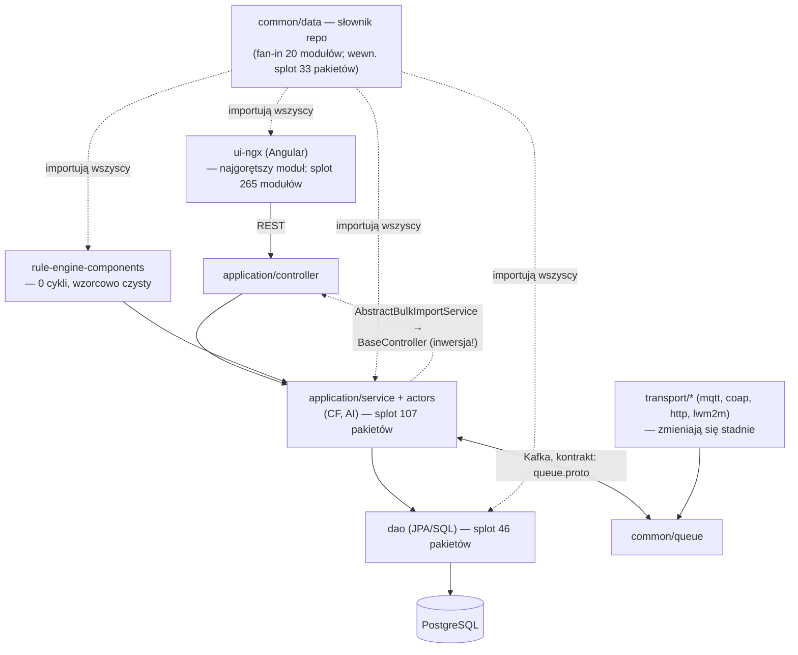

# Mapa repo ThingsBoard — przewodnik na start

> Synteza: [artifact-1-territory.md](artifact-1-territory.md) (aktywność gita, 12 mies.),
> [artifact-2-structure.md](artifact-2-structure.md) (graf importów ui-ngx **i** graf
> pakietów/modułów Javy), [artifact-3-contributors.md](artifact-3-contributors.md)
> (kontrybutorzy).

## 1. TL;DR

ThingsBoard to platforma IoT: monolityczny serwer Java/Spring (`application`) +
frontend Angular (`ui-ngx`) + wspólne moduły (`common/*`, `dao`, `rule-engine`,
`transport/*`), spinane przez Kafkę (kontrakt `queue.proto`) i PostgreSQL. Praca
ostatniego roku skupiała się na dwóch nowych podsystemach — **Calculated Fields**
(backend aktorowy + UI) i **integracji AI/LLM** — oraz wielkim pushu frontendowym
(widgety, alarm-rules). Obie strony stacku mają tę samą chorobę: **jeden wielki
splot zależności na warstwę** — w `ui-ngx` silnie spójna składowa 265 modułów,
w Javie splot 107 pakietów w `application` (wszystkie kontrolery + aktory +
serwisy), 46 w `dao` i 33 w `common/data`. W obu przypadkach spina go pojedyncza
krawędź odwracająca warstwy (`shared/models → core/utils.ts` na froncie,
`AbstractBulkImportService → BaseController` na backendzie). Różnica: nowy kod
frontendowy (alarm-rules, CF) jest czysty, ale **backendowe CF — najgorętszy kod
roku — siedzi w środku splotu** (dwukierunkowa zależność aktorzy ↔ serwisy CF),
a jego dwoje głównych autorów nie commituje od Q1 2026.

## 2. Teren

**Duża odpowiedzialność (rdzeń aktywności):** `ui-ngx` (~10 tys. dotknięć plików
w rok), `application` (~4,5 tys.), `common/data` (~3,1 tys.), `dao` (~1,7 tys.).
**Peryferia:** `monitoring`, `edqs`, `netty-mqtt`, `rest-client` — pojedyncze
zmiany rocznie.

**Moduły głębokie** (mało plików, duży promień rażenia): `common/data` — słownik
repo, od którego zależy 20 z 60 modułów Mavena *(graf modułów)*; `common/queue` +
`queue.proto` (kontrakt międzymodułowy); `common/transport` (abstrakcja czterech
transportów). **Płytkie/szerokie:** `ui-ngx` (1676 plików TS), `application`
(1298 klas, konsumuje 23 moduły wewnętrzne — każda zmiana gdziekolwiek może
go dotknąć).

**Aktywność w czasie:** rok zaczął się backendowo (Q3 2025: AI/LLM + rozruch CF),
szczyt w Q4 2025 (CF + alarm-rules + masowa regeneracja widget_types), od Q1 2026
środek ciężkości przeszedł na frontend, Q2 2026 to stabilizacja i testy.
Szczegóły: artifact-1 §2.

**Gdzie katalogi kłamią:**
- `ui-ngx/.../shared/` nie jest „wspólne-niezależne": 23 importy idą w górę do
  feature-modułów, a `shared/models` ciągnie `core` (51 naruszeń) *(graf importów)*.
- `modules/home/models/widget-component.models.ts` mieszka w feature-module, ale
  ma fan-in 156 i importują go `core` i `shared` — de facto warstwa wspólna
  *(graf importów)*.
- W Javie pakiet `controller` nie jest „szczytem stosu": przez
  `AbstractBulkImportService → BaseController` kontrolery są osiągalne z warstwy
  serwisów — jedna krawędź scala ~80 kontrolerów z aktorami i serwisami w SCC
  107 pakietów *(jdeps)*.
- `common/data` na poziomie modułów jest czystym fundamentem (zależy tylko od
  protobuf i langchain4j-core), ale wewnętrznie pakiet bazowy ↔ `id` tworzą
  god-package spinający 33 pakiety *(jdeps)*.
- `application/src/main/data/json/system/widget_types` (694 dotknięcia) to
  definicje widgetów aktualizowane hurtowo — **sprzężenie „przez regenerację"**,
  tanie; nie świadczy o złożoności ręcznej edycji *(historia gita)*.
- `locale.constant-en_US.json` — najczęściej zmieniany plik repo (164), ale to
  dopisywanie kluczy przy każdej zmianie UI, sprzężone tylko z `ui-ngx`
  *(historia gita)*.

## 3. Realne powiązania

| Sprzężenie | Skąd wiemy | Charakter |
|---|---|---|
| `application` + `common/data` + `dao` (115 wspólnych commitów) | historia gita **+ graf modułów** | Kanoniczny konwój zmiany encji: model → DAO → serwis. Importowo to zależność jednokierunkowa (zdrowa); konwój bierze się ze współzmian, nie z cykli. |
| `common/data` ↔ wszystko | historia gita + graf modułów (fan-in 20) | Wspólny słownik; zmiana tu ma najszerszy promień rażenia. Huby klasowe: `TenantId` (fan-in 489 w `application`), `EntityId` (345), `EntityType` (157). |
| Splot 265 modułów w `ui-ngx` (169 models + 54 core + 26 home); 762 cykle | **graf importów** (dependency-cruiser) | Każdy plik dotykający `widget.models.ts` / `core/utils.ts` / `core.state.ts` ma domknięcie ~315 modułów. Wektor inwersji: `core/utils.ts` importowany przez modele. |
| Splot 107 pakietów w `application`; 46 w `dao`; 33 w `common/data` | **graf pakietów** (jdeps) | Moduły Mavena są acykliczne (wymusza Maven), ale wewnątrz modułów cykle wracają. `rule-engine-components`: 0 cykli — odpowiednik czystego `rule-node` na froncie. |
| `actors.calculatedField ↔ service.cf` — dwukierunkowo | **jdeps** (poziom klas) | Najgorętszy kod roku bez szwu do testowania; domknięcie `CalculatedFieldManagerMessageProcessor` ≥ 391 klas z 6 modułów. |
| Połowa classpathu Javy przechodnia (134 used-undeclared w 4 modułach) | **dependency:analyze** | `application` używa wprost `org.thingsboard:{data,message,dao-api,proto,cache}` bez deklaracji; `dao` cały stos JPA dostaje transitive. Bump wersji w cudzym pom zmienia zachowanie modułu. |
| `transport/mqtt+coap+http+lwm2m` zmieniają się stadnie (43 wspólne commity) | historia gita | Wspólna abstrakcja w `common/transport`; importowo wszystkie wiszą na `transport-api` (fan-in 8). |
| `queue.proto`, `thingsboard.yml`, `schema_update.sql` — huby cross-repo (śr. 4,5–5,1 obszaru na commit) | historia gita | Jeśli commit je dotyka, niemal na pewno zmiana wielomodułowa. `schema_update.sql` to migracje — częściowo koszt „dopisania wpisu". |
| `msa/*`, skrypty, docker, edqs, implementacje transportów | **unknown** — bez grafu | jdeps objęło 5 gorących modułów; reszta backendu i infrastruktura wnioskowana tylko z gita. |

## 4. Strefy ryzyka

1. **Calculated Fields backend** (`actors/calculatedField`, `service/cf`) —
   najintensywniej zmieniany kod Javy w środku splotu (aktorzy ↔ serwisy
   dwukierunkowo, domknięcie ~391 klas), a dwoje głównych autorów nieaktywnych
   od Q1 2026 — ryzyko strukturalne × ryzyko wiedzy.
2. **Framework widget/dashboard w ui-ngx** — serce splotu 265 modułów; zmiana
   huba (`widget.models.ts`, fan-in 356) dotyka setek plików, regresja realnie
   tylko e2e.
3. **`core/utils.ts` + `core.state.ts`** (UI) i **`BaseController`** (Java) —
   pojedyncze pliki, przez które przechodzą setki zależności; każda zmiana
   jest globalna.
4. **Oś encji `common/data`+`dao`** — konwój trzech modułów + migracje SQL;
   łatwo o niekompletną zmianę; do tego classpath w dużej mierze przechodni
   (zmiana wersji w jednym pom działa na odległość).
5. **`queue.proto` / kontrakty kolejek** — zmiana = konwój przez transporty,
   application i edqs; błąd psuje komunikację międzymodułową.
6. **AI/LLM** (`common/data/ai`, `TbAiNode`) — kod młody, multi-provider,
   bus factor = 1; langchain4j wszedł nawet do fundamentowego `common/data`.

## 5. Kogo zapytać

| Strefa | Kontakt | Uwagi |
|---|---|---|
| Calculated Fields backend | **Viacheslav Klimov** (żywy kontakt), historycznie: IrynaMatveieva, dshvaika | Dwoje głównych autorów nieaktywnych od Q1 2026 |
| Widget/dashboard, splot UI | **Igor Kulikov** (architektura frameworku), Maksym Tsymbarov (bieżące widgety) | Kulikov mało aktywny (6 commitów/kwartał), ale wiedza unikatowa |
| Fundamenty UI: formularze, key-filtry, shared | **Vladyslav Prykhodko** | |
| Alarm rules | **ArtemDzhereleiko** (UI), Viacheslav Klimov (backend/testy) | |
| Oś danych dao/common-data, uprawnienia | **dashevchenko**; Kafka/kolejki: **Andrii Landiak** | Najaktywniejsi w ostatnim kwartale |
| AI/LLM | **Dmytro Skarzhynets** | Bus factor = 1, aktywność spadła |

## 6. Pierwszy dzień — co przeczytać, w tej kolejności

1. `application/src/main/resources/thingsboard.yml` — spis treści platformy:
   każdy podsystem ma tu sekcję konfiguracyjną.
2. `common/proto/src/main/proto/queue.proto` — kontrakt komunikacji
   międzymodułowej; jakie wiadomości płyną przez Kafkę.
3. `dao/src/main/resources/sql/schema-entities.sql` — model danych w jednym
   pliku; razem z `application/src/main/data/upgrade/basic/schema_update.sql`
   (jak ewoluuje schemat).
4. `common/data/src/main/java/org/thingsboard/server/common/data/cf/configuration/CalculatedFieldConfiguration.java`
   — wejście do dominującego tematu roku (CF) od strony modelu.
5. `application/src/main/java/org/thingsboard/server/actors/calculatedField/CalculatedFieldManagerMessageProcessor.java`
   — serce aktorowego przetwarzania CF (najgorętszy i najbardziej spleciony kod Javy).
6. `application/src/main/java/org/thingsboard/server/controller/BaseController.java`
   — wspólna baza ~80 kontrolerów REST; widać tu też, czemu serwisy nie powinny
   go importować (a importują).
7. `ui-ngx/src/app/shared/models/widget.models.ts` — centrum frontendu
   (fan-in 356); czytając importy zrozumiesz splot UI.
8. `ui-ngx/src/app/core/utils.ts` — niepozorny plik trzymający 490 cykli;
   przykład, jak NIE wyglądają warstwy. Obrazy: `artifact-2-core-knot.svg` (UI)
   i `artifact-2-java-modules.svg` (moduły Javy).

## 7. Ograniczenia

- **Okno czasowe: 12 miesięcy** (2025-06 → 2026-06, 2323 commity, branch
  `master`). Kod starszy, stabilny — np. rdzeń rule-engine, security — jest na
  mapie aktywności niewidoczny, co nie znaczy, że jest nieważny.
- **Grafy zależności pokrywają:** `ui-ngx/src/app` (dependency-cruiser) oraz
  5 gorących modułów Javy — `application`, `common/data`, `dao`,
  `rule-engine-components`, `common/queue` (jdeps na skompilowanych klasach)
  + graf wszystkich 60 modułów Mavena z pom.xml. **Bez grafu (unknown):**
  `msa/*`, implementacje transportów, `edqs`, skrypty, docker/packaging —
  tam sprzężenia wnioskujemy tylko ze współwystępowania w commitach, które
  bywa mylące.
- **Granice analizy bajtkodu:** jdeps i `dependency:analyze` nie widzą wiązań
  runtime (component-scan Springa, refleksja, sterowniki JDBC) — stąd „nieużywane"
  transporty coap/snmp w `application` to fałszywe pozytywy; domknięcia
  tranzytywne klas to dolne ograniczenia (liście z innych modułów nieekspandowane).
- Mapa kontrybutorów mierzy **liczbę commitów, nie głębokość wiedzy**; review
  i wiedza architektoniczna bez commitów są niewidoczne. Tożsamości łączone
  heurystycznie (`dshvaika` ≠ `Andrii Shvaika` — nie potwierdzono).
- Współzmiany „przez regenerację" (widget_types, locale, częściowo migracje)
  zawyżają liczniki aktywności — oznaczono je w §2; nie czytać ich jako
  złożoności.
- Mapa NIE mówi: o jakości kodu, pokryciu testami, wydajności ani o planach
  produktowych — tylko gdzie repo żyło, jak jest spięte (tam, gdzie był graf)
  i kto przy tym pracował.

---
*Wygenerowano: 2026-06-10, zaktualizowano 2026-06-11 (synteza z częścią Java artefaktu 2).*
